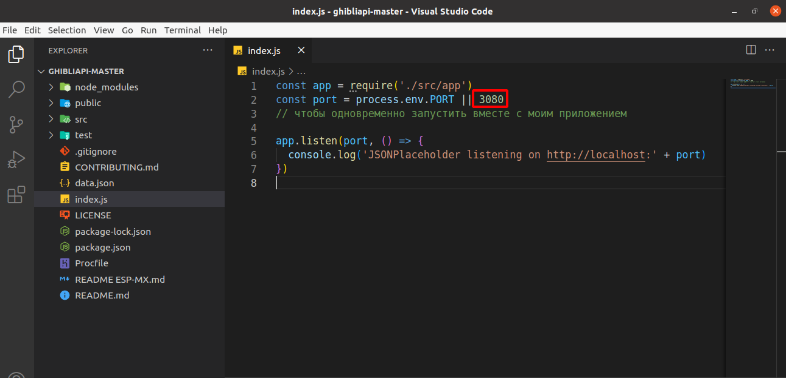

# Ghibli films

## Информация о данном проекте

Это учебный проект, созданный в рамках первичного ознакомления с React, [Create React App](https://github.com/facebook/create-react-app) и React hooks useState и useEffect.

Данное приложение предоставляет список фильмов студии Ghibli с возможностью узнать подробную информацию о них.

## Информация об используемом API и запуск приложения

Приложение получет информацию со стороннего API - [Studio Ghibli API](https://ghibliapi.herokuapp.com).

Данное API ранее располагалось на хостинге Heroku, но сейчас недоступно.

Поэтому для корректной работы приложения необходимо склонировать к себе на компьютер [репозиторий API](https://github.com/janaipakos/ghibliapi) и внести следующее изменение в файл index.js:
заменить номер порта с 3000 на 3080.

В самом приложении Ghibli films необходимые для работы изменения уже внесены:
- в файле компонента [FilmList.js](src/components//FilmList.jsx) была закомментирована 13 строка, в которой отправлялся fetch на ранее работавший адрес API - 'https://ghibliapi.herokuapp.com/films',
- и добавлена 14 строка с отправкой fetch на новый адрес - 'http://localhost:3080/films' (для корректной работы обоих приложений на одном компьютере).

После чего необходимо запустить API командой `npm start`, а затем запустить данное приложение такой же командой.

## Подробнее о работе приложения

Список фильмов представлен в формате аккордеона ([Accordion](src/components/Accordion.jsx)) - при нажатии на интересующий фильм открывается его секция и становится доступной к ознакомлению подробная информаиция о выбранном фильме, а имменно:
- постер;
- описание;
- оригинальное название;
- директор фильма;
- продюсер фильма;
- дата выхода;
- длина фильма в минутах.

[Аккордеон](src/components/Accordion.jsx) реализован при помощи хука useState.
Состояние компонента меняет по нажатию на него. В зависимости от состояния отображается больше или меньше информации.

Сам список фильмов загружается благодаря использованию хука useEffect с пустым массивом зависимостей при первом рендере компонента и сохраняется в состояние компонента благодаря хуку useState.

Постеры к фильмам сохранены в папке [public/img](public/img) и названы в соответсвии с каждым фильмом.

Состояние компонента по умолчанию содержит 3 фильма без дополнительной информации о них:
- Castle in the Sky';
- 'My Neighbor Tororo';
- 'Grave of the Fireflies'.

Поэтому при запуске только приложения Ghibli films (без API), отобразится список только из 3 фильмов, а в информации о выбранном фильме - только постер, остальные пункты будут пустыми.

